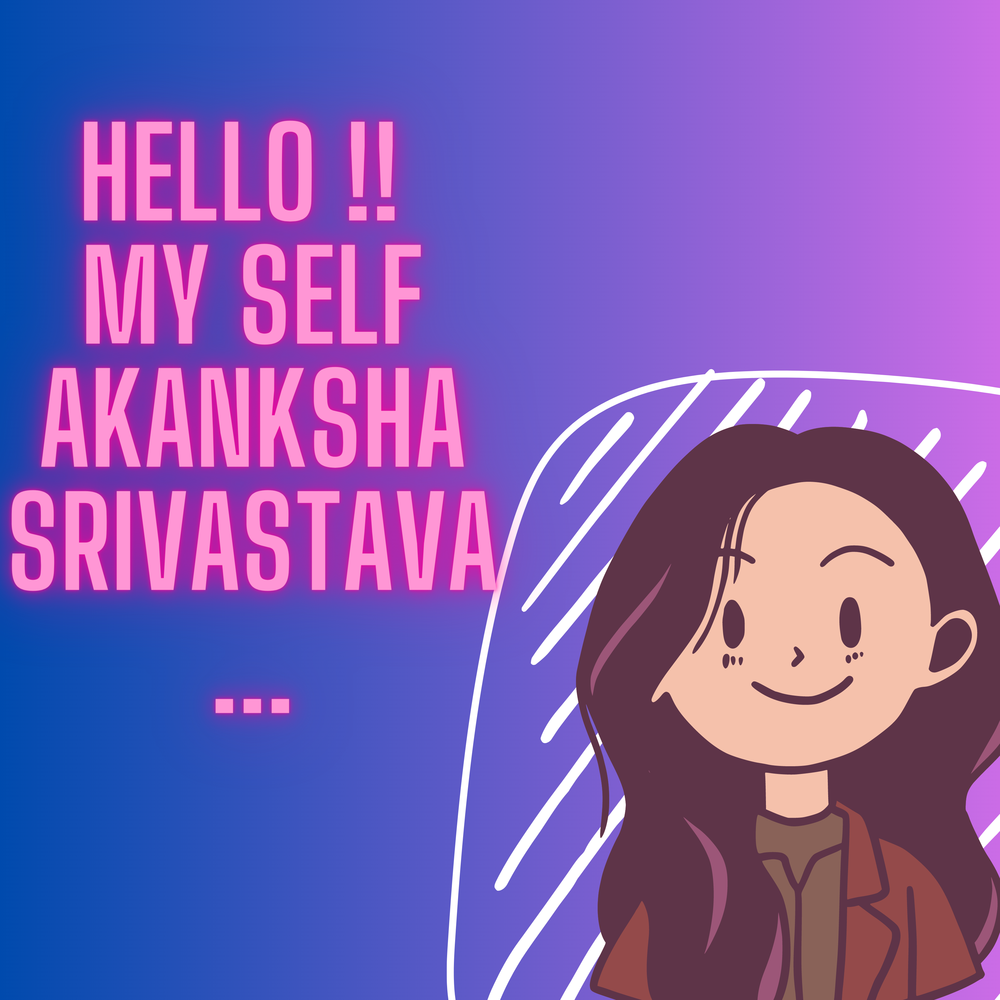

# Hi there 👋

<!--
**akanksha042/akanksha042** is a ✨ _special_ ✨ repository because its `README.md` (this file) appears on your GitHub profile.

Here are some ideas to get you started:

- 🔭 I’m currently working on ...
- 🌱 I’m currently learning ...
- 👯 I’m looking to collaborate on ...
- 🤔 I’m looking for help with ...
- 💬 Ask me about ...
- 📫 How to reach me: ...
- 😄 Pronouns: ...
- ⚡ Fun fact: ...
-->

# Welcome to My Github Profile! 💫

  

Hello there! Welcome to my Github profile 🙋‍♀️.

I'm thrilled to have you here. Let me take a moment to introduce myself and give you a glimpse into my world of coding and passion for technology.

 
  Visitor count 
  

## About Me ⚡

I am Akanksha Srivastava, Student at Bharati Vidyapeeth (Deemed to be University) Department of Engineering and Technology, Navi Mumbai, specializing in Computer Science and Engineering. I am a technology enthusiast. Technology excites me and I'm always in awe of change drives in the tech world. 
As a computer science student, I have gained a solid foundation in programming, data structures, and algorithms. I am passionate about solving complex problems and creating innovative solutions using technology. And what I might lack in skills but I will make it up with my determination to learn. Continued to expand my horizons and accelerate the performance curve. Which has shaped my skills and fueled my curiosity for exploring new horizons in the world of technology.

I'm always eager to learn and grow as a developer, constantly seeking new challenges and opportunities to expand my knowledge. I believe in the power of collaboration and open source, which is why I'm an active contributor. I'm dedicated to making a positive impact through my code.

## Key Skills ✨
- Programming languages: Java, C, Python
- Web development: HTML, CSS, JS, React JS
- Data analysis: SQL
- Soft skills: Problem-solving, communication, teamwork

## Interests ✨
Participate in hackathons and coding competitions
President at Codechef BVPDET 
Enjoy watching anime and reading books in my free time

## Projects ✨

I'm proud to have worked on various projects that have allowed me to apply my skills and explore different domains. 
- https://github.com/akanksha042/Carrom-Game-In-Java
- https://github.com/akanksha042/Snake-Game
- https://gdsc-bvpdet-nm.github.io/index.html

For a comprehensive list of my projects, please visit my repositories for more info... 

## Open Source Contributions

- I strongly believe in giving back to the community, and open-source contributions have been a significant part of my journey. 
and to do that I've Participated in Hacktoberfest and contributed in many Projects.

I'm always excited to collaborate on new open-source projects and contribute to the community. Feel free to reach out if you have any interesting projects in mind.

## Connect with Me 🌟

I love connecting with fellow developers, technology enthusiasts, and anyone interested in discussing exciting ideas. You can find me on various platforms:

- [LinkedIn](https://www.linkedin.com/in/akanksha-srivastava-23413a225/): Connect with me on LinkedIn for professional networking.

Feel free 

## Statistics 📊📈

  

